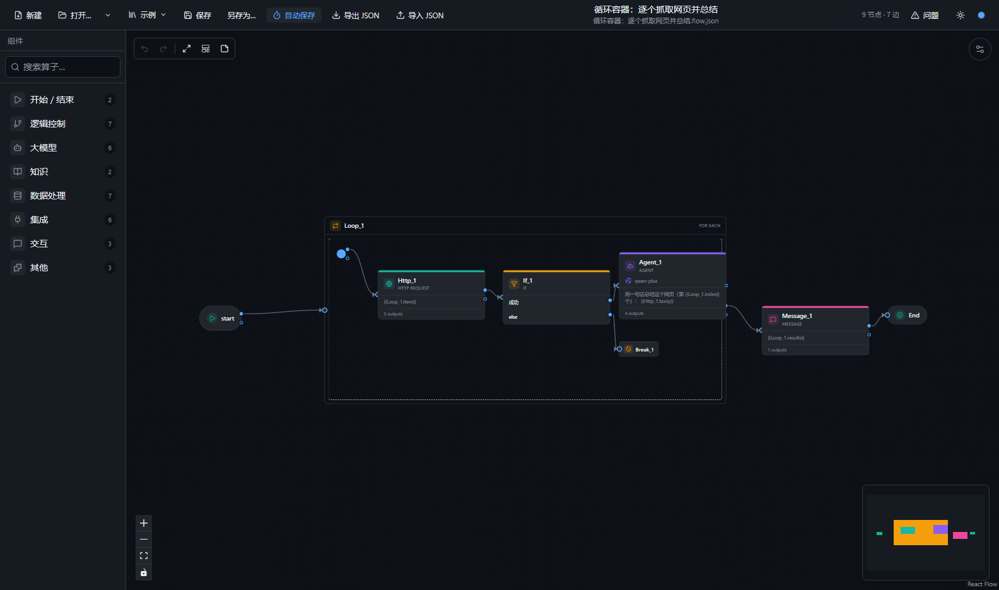
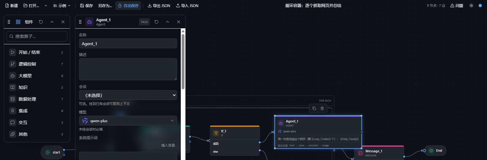
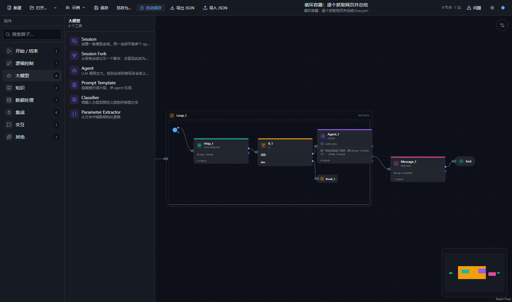

# Orchestrator Desktop

独立的 Electron 可视化工作流 / 智能体编排工具：只读写 JSON，不接后端、不存 API Key、不执行流程。布局参考 RAGFlow 的 Agent 画布。

## Overview

Orchestrator Desktop is a standalone Electron app for designing agent and workflow graphs. It only reads and writes JSON files: there is no backend, no hosted service, and it does not run the graph or store LLM API keys. The canvas layout follows RAGFlow’s agent editor — a floating two-level component palette, a React Flow graph with a transparent compact toolbar, and a floating property inspector. Operators are registered in a data-driven public library; extra categories can be dropped into a gitignored private folder and are picked up at build time. Windows x64 binaries are published on GitHub Releases; macOS and Linux can be built from source.



## 下载 / Download

预编译包见 [GitHub Releases](https://github.com/Xpropel/orchestrator-desktop/releases/latest)（当前版本 `v0.1.1`）。目前只提供 **Windows x64**：

| 文件 | 说明 |
| --- | --- |
| `Orchestrator.Desktop-0.1.1-portable.exe` | 免安装，双击运行 |
| `Orchestrator.Desktop-0.1.1-setup.exe` | NSIS 安装包，可选安装目录 |

可执行文件未代码签名，Windows SmartScreen 可能提示「未知发布者」，选择「仍要运行」即可。macOS（`dmg`）与 Linux（`AppImage`）可从源码用 `electron-builder.yml` 中的目标打包，尚未测试。

## 界面预览

| 悬浮属性面板 + 模型徽标 | 悬浮组件栏 + 飞出面板 |
| --- | --- |
|  |  |

## 功能特性

- **悬浮组件栏**：玻璃质感卡片，默认停在画布左上；可拖动、右缘拉宽、底边拉高。窄于阈值时吸附成仅图标的窄栏，拉回即恢复文字。点类别在卡片旁弹出工具飞出面板（右侧放不下自动翻到左侧）；搜索时跨类别平铺；把整个类别拖到画布会弹出算子选择器。关闭后收成左上角圆钮。
- **悬浮属性面板**：单击节点打开（拖动 / 框选 / 右键只改选中，不弹面板）。可拖动、左缘拉宽、底边拉高、折叠；位置与尺寸记在 `localStorage`。无节点时收成右上角「流程设置」。两张卡片共用 `ui/floating-card` 的拖拽 / 夹边 / 记忆逻辑。
- **紧凑工具栏**：36px、背景透明，悬浮在画布顶部，按钮组之间的空白可直接拖动画布；原生菜单栏默认隐藏（按 Alt 临时显示，快捷键不受影响）。
- **节点可拉伸**：任务卡、分支、开始、结束、跳出、容器、便签选中后都有四角 / 四边把手；尺寸随文档保存，可撤销。
- **数据驱动算子库**（`src/renderer/src/core/library/`）：注册表共 37 个算子；侧栏隐藏 `loop-start`（随循环容器自动创建），故面板可见 36 个。

  | 类别 | key | 数量 |
  | --- | --- | --- |
  | 开始 / 结束 | `control` | 2 |
  | 逻辑控制 | `logic` | 8（侧栏 7，`loop-start` 隐藏） |
  | 大模型 | `llm` | 6 |
  | 知识 | `knowledge` | 2 |
  | 数据处理 | `data` | 7 |
  | 集成 | `integration` | 6 |
  | 交互 | `interaction` | 3 |
  | 其他 | `misc` | 3 |

- **LLM 会话**：`session` 建立上下文，`session-fork` 分叉副本，`agent` 可挂到会话上复用前缀。
- **循环容器**：`foreach` / `while` 新建时自动带 `loop-start`；节点可拖入拖出；`break` 只能放在容器内。从容器内部拉线：落在容器空白处在容器内新建节点，落到容器外会被拒绝；容器外的连线落到容器身上即连到循环入口。
- **校验引擎**（画布变更后约 300ms 防抖）：`NO_START`、`UNREACHABLE`、`DEAD_END`、`MISSING_REQUIRED`、`UNKNOWN_REFERENCE`、`REFERENCE_NOT_UPSTREAM`、`TYPE_MISMATCH`、`DUPLICATE_NAME`、`EMPTY_CONTAINER`、`BREAK_OUTSIDE_LOOP`、`WHILE_NO_CONDITION`、`FOREACH_ITEMS_NOT_ARRAY`、`BRANCH_NO_TARGET`、`CROSS_CONTAINER_EDGE`、`CYCLE`、`UNKNOWN_OPERATOR`，以及会话补充规则（`SESSION_TYPE_MISMATCH`、`SESSION_NOT_UPSTREAM`、`AGENT_NO_MODEL`、`FORK_UNUSED`、`SESSION_CONCURRENT_WRITE`）。扩展可再挂自己的规则。底部「问题」面板可定位节点。
- **变量引用**：`{{Node.var}}`（节点名 + 输出变量）；全局 `{{sys.query}}` / `{{sys.files}}` / `{{sys.now}}`；start 入参按该 start 的节点名暴露。属性面板的 `variable` 字段为选择器，`template` / `expression` 可插入变量。
- **有序出口**：同一节点多条出边可在端口上拖动换位（属性面板「下游顺序」亦可）；`+` 小球始终可拉新线。把连线拖到目标节点本体松手即连接；拖到空白处弹出算子选择器。
- **输出变量**：节点卡片底部列出该节点暴露给下游的变量名（含 `start.inputs` / `dataset.fields` 声明的字段）；属性面板给出 `{{节点名.变量}}` 形式的引用。它与出边数量无关。
- **模型徽标**：LLM 相关节点显示 DeepSeek / 通义千问图标 + 模型名（预设 `deepseek-chat`、`deepseek-reasoner`、`qwen-plus`、`qwen-max`，也可自定义字符串）。编排器不配置、不保存 API Key。
- **多入口**：可添加多个 `start`；空画布第一个 id/name 为 `start`，其后为 `start:<id>`。最后一个 start 不可删除。
- **撤销 / 重做**：Ctrl+Z / Ctrl+Y（或 Ctrl+Shift+Z）。
- **自动保存**：仅 Electron；已命名且脏时按间隔静默写回（30s / 1m / 2m / 5m，默认 1 分钟）。未命名文件不自动保存。
- **崩溃恢复**：仅 Electron。变脏 3 秒后写第一份快照，之后每 20 秒写入 `userData/recovery.flow.json`；保存后清除；下次启动若发现快照会询问是否恢复。
- **导入 JSON**：工具栏「导入 JSON」（Ctrl+I）、或把 `.json` 拖到窗口。识别本格式、RAGFlow DSL（`graph` + `components`、无 `version`）、RAGFlow 外层 `{title, dsl}`、以及裸 `{nodes, edges}`。非本格式按未命名载入，不会覆盖原文件。
- **导出 JSON**：工具栏下载当前流程（`.flow.json`）。保存 / 另存为写入磁盘。
- **示例**：工具栏「示例」载入打包内的 `examples/*.flow.json`。
- **主题**：深色 / 浅色，强调色 blue / violet / emerald / amber，记在 `localStorage`。
- **自动布局**：画布底部工具条「自动布局」（Dagre，含容器内子节点）。
- **便签**：`note` 算子，无端口，不进入 `components`。

## 扩展：私有类别与示例

公开仓库只带通用算子。本机若要加自己的类别、示例或笔记，放到下列 **gitignore** 目录即可，构建时自动合并，公开 release 不会带上它们：

| 位置 | 作用 |
| --- | --- |
| `src/renderer/src/core/library/private/*.ts` | `export default` 一个 `LibraryExtension`（类别 / 算子，可选 `rules`、`globals`）。`import.meta.glob` 在构建期发现并并入注册表。 |
| `examples/private/*.flow.json` + `examples/private/index.json` | 与公开 `examples/index.json` 同结构；清单与流程文件在渲染进程和主进程都会接在公开示例后面。目录不存在时忽略。 |
| `docs/private/` | 本地笔记与专属类别说明，不进 Git。 |

`library/private/` 目录本身会进 Git（只提交 `README.md`），因此克隆后 glob 始终有一个目录可扫。

最小扩展（通过 `satisfies LibraryExtension` 对齐真实契约）：

```ts
import type { LibraryExtension } from '../extension'
import { op } from '../define'

export default {
  categories: [{ key: 'demo', title: 'Demo', order: 200, exclusive: true, icon: 'Sparkles' }],
  operators: [
    op(
      'demo.echo',
      'Echo',
      'Echo a string',
      'Sparkles',
      '#6366f1',
      'demo',
      'task',
      [{ key: 'text', label: 'text', type: 'string' }],
      [{ name: 'text', type: 'string' }]
    )
  ]
} satisfies LibraryExtension
```

通用工厂仍是 `src/renderer/src/core/library/define.ts` 的 `op()`。扩展还可以声明 `OperatorCategory.model`（该类别所有算子的默认模型徽标）和 `globals` 段落（流程设置里的字符串字段）。

## 示例

`examples/*.flow.json` 随应用打包：

| 名称 | 说明 |
| --- | --- |
| 循环容器：逐个抓取网页并总结 | foreach 内 loop-start → http → if → agent / break，容器外用 `results`。 |

## 快捷键

Electron 由原生菜单的加速键分发（菜单栏默认隐藏，按 Alt 显示）；浏览器模式由 `use-app-shortcuts.ts` 映射同一组动作。

| 动作 | 快捷键 |
| --- | --- |
| 新建 / 打开 / 导入 JSON / 保存 / 另存为 | Ctrl+N / Ctrl+O / Ctrl+I / Ctrl+S / Ctrl+Shift+S |
| 撤销 / 重做 | Ctrl+Z / Ctrl+Y（或 Ctrl+Shift+Z） |
| 复制 / 粘贴 / 克隆 | Ctrl+C / Ctrl+V / Ctrl+D |
| 删除 | Delete（浏览器模式另支持 Backspace） |

焦点在文本框时，编辑类动作不接管，留给原生撤销 / 输入。

## 文件格式

落盘为 JSON，字段顺序 `version`、`title`、`globals`、`graph`、`components`（见 `serializeDocument`）：

- `version` 必须为 `1`
- `graph.nodes` / `graph.edges` 是画布数据；节点 `data.label` = 算子 type（全小写，如 `agent`、`http`），`data.name` 是画布唯一名，`data.form` 是参数
- 节点 id 形如 `agent:xxxxxxxx`（`createNodeId`）；空画布入口为 `id/name = start`；容器子节点带 `parentId`（相对坐标）
- `components` 由图计算：`obj.component_name` / `obj.params` / `upstream` / `downstream` / `parent_id`；便签不进 `components`
- 扩展可以声明自己的 `globals.<key>` 段落（流程设置里按字段编辑）；其余未声明的键按 JSON 编辑

旧文件（PascalCase 算子名 `Begin` / `Agent` / …）打开时按 `migrations.ts` 映射。缺少 `version` 但带 `graph` + `components` 的 RAGFlow 画布 JSON 可**单向导入**；未知算子降级为 `custom`（保留原参数）。导入还接受 RAGFlow 模板外层 `{title, dsl}` 与裸 `{nodes, edges}`。

## 从源码构建 / 开发

需要 Node.js `^20.19.0 || >=22.12.0`（electron-vite 5）。仓库根目录 `.npmrc` 指向 npmmirror 与 Electron 镜像；中国大陆以外可删掉该文件，改用官方 registry。

```bash
npm install
npm run dev          # Electron 窗口（主进程 + 预加载 + 渲染进程）
npm run dev:web      # 仅渲染进程，浏览器访问 http://localhost:5174
npm run typecheck
npm test
npm run lint
npm run build
npm run dist         # 按当前平台打安装包（国内可设 ELECTRON_BUILDER_BINARIES_MIRROR）
```

浏览器模式没有 `window.api`：用本机文件选择器打开、用下载保存；崩溃恢复、最近文件与自动保存不可用。

产物目录：`out/`（编译）、`dist/`（安装包）。

### 开发调试

仅在未打包（`!app.isPackaged`）时生效；打包应用忽略这些变量（残留 `ORCH_SMOKE=1` 也不会删恢复快照或截图退出）：

| 环境变量 | 作用 |
| --- | --- |
| `ELECTRON_RENDERER_URL` | electron-vite 开发态渲染地址；打包应用忽略 |
| `ORCH_REMOTE_DEBUG=9333` | 打开 Chromium remote debugging，CDP 见 `http://127.0.0.1:9333/json` |
| `ORCH_AUTO_UNSAVED_CHOICE=cancel\|discard\|save` | 未保存对话框自动选择，便于自动化 |
| `ORCH_AUTO_SAVE_DIALOG=cancel` | 另存为对话框自动取消 |
| `ORCH_AUTO_SAVE_DIALOG=<path>` | 另存为直接写入指定路径并返回（仅未打包） |
| `ORCH_SMOKE=1` | 冒烟：截图到 `.screenshots/smoke.png` 后退出 |
| `ORCH_SMOKE_EXAMPLES=1` | 冒烟时依次打开每个内置示例并截图 |

开发模式（`import.meta.env.DEV`）会把 `useFlowStore` 与 DSL 编解码挂到 `window.__orch`，生产构建不挂。

## 目录结构

```
src/
  main/                 Electron 主进程（index.ts 只装配）
    window/             窗口创建、标题、关窗守卫、未保存对话框、app-state、smoke / smoke-env
    ipc/                file / recovery / recovery-store / app / recent / examples
    menu/               原生菜单（文案与渲染进程共享 src/shared/action-labels.ts）
    security/           CSP、路径白名单、导航拦截、normalizePath
  preload/
  shared/               主进程 + 渲染进程共享文案（action-labels）
  renderer/src/
    core/               纯领域：schema / registry / library / graph / validate / dsl / palette
    state/              zustand：flow / validation / ui / theme / settings
    features/           canvas · palette · inspector · issues · files
    app/                装配：App、Toolbar、boot、theme、menu-actions、shortcuts
    platform/           window.api 桥与浏览器回退
    ui/                 无业务基础控件
    shared/             MIME 常量
    test/setup.ts       vitest 加载算子库
scripts/                csp-plugin.ts · generate-icon.cjs · run-smoke.cjs
examples/               内置示例与 index.json
build/icon.png          应用图标（electron-builder）
docs/                   规格、重构计划、README 截图（`docs/private/` gitignore）
```

路径别名：渲染进程 `@/` → `src/renderer/src`；`@shared/` → `src/shared`。

内部文档：`docs/phase5-spec.md`（功能规格）、`docs/refactor-plan.md`（分层）。`docs/private/` 是 gitignore 的本地笔记。

## 致谢 / Acknowledgements

布局与交互参考 [RAGFlow](https://github.com/infiniflow/ragflow)（Apache-2.0）。构建于 React Flow（@xyflow/react）、Zustand、Immer、Tailwind、Dagre、lucide-react、electron-vite、electron-builder。DeepSeek、通义千问（Qwen）的模型标识是其权利人的商标；节点上的 SVG 取自 RAGFlow 的 icon font。

## 许可证

MIT，见 [LICENSE](LICENSE)。
